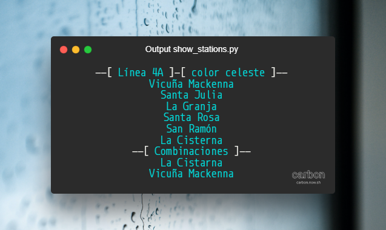
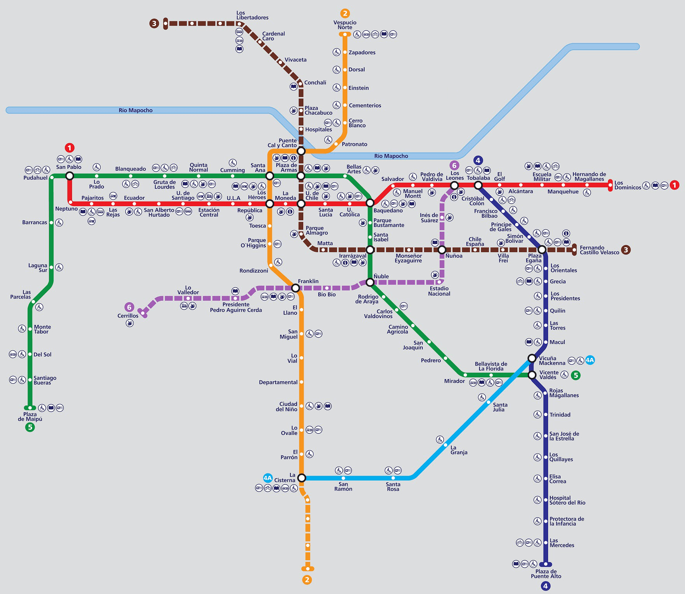

<p align="center">
    
</p>

<div align="center">

# Listado de las estaciones del metro

[](https://www.python.org/)

</div>

<p align="center">
  Listado de las estaciones de la red del metro de Santiago de Chile
</p>

## ¿Qué fin tiene este listado?
El fin del listado es poder tener indexadas todos los nombres de las estaciones de todos los tramos (líneas) para ser usado en aplicaciones futuras.

## ¿Cuándo se actualizó?
Actualizado en mayo del año 2022.

## ¿Qué archivo es y contiene?
El archivo **metro_stations.json** contiene un listado con todos los nombres de las estaciones del metro de Santiago de Chile indexados en formato JSON.

## ¿Qué patrón sigue el listado?
El listado viene organizado por líneas (tramos), siendo la **clave** su número respectivo, y el **valor** es **un objeto** con el color de la línea, un arreglo con las estaciones y un arreglo con las combinaciones disponibles.

### Patrón
```js
{
  "0": {
      "color": "",
      "estaciones": [

      ],
      "combinaciones": [

      ]
    }
}
```

### Ejemplo ficticio
```js
{
  "12": {
      "color": "blue",
      "estaciones": [
        "Marfullsen", "Sorrego", "Morat", "Maikowski", "Karlshafen"
      ],
      "combinaciones": [
        "Sorrego", "Morat"
      ]
    },
    ...
}
```

## ¿Es posible visualizar el contenido del archivo en formato JSON?
Si, los datos pueden ser visualizados ejecutando el archivo **show_stations.py**.

<p align="center">
  <a href="./show_stations.py" rel="noopener">
  </a>
</p>

## Mapa de la red del metro de Santiago de Chile

<p align="center">
  <a href="https://www.dtpm.cl/index.php/sistema-transporte-publico-santiago/metro" rel="noopener">
  </a>
</p>

## Referencias

- [Underground icons created by smalllikeart - Flaticon](https://www.flaticon.com/free-icons/underground "underground icons")
- [Metro icons created by Freepik - Flaticon](https://www.flaticon.com/free-icons/metro "metro icons")
- Code image by [Carbon](https://carbon.now.sh/)
- Photo by Thom Milkovic on Unsplash